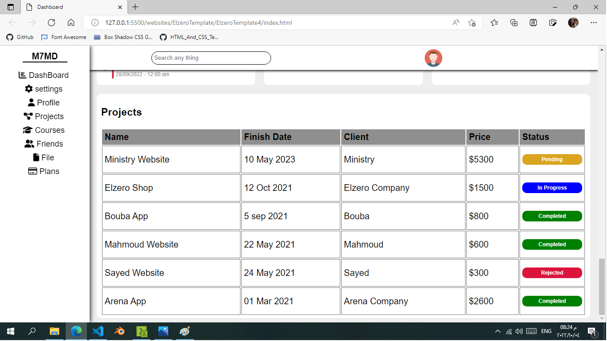

<h1 align="center">
	ElzeroTemplate4
</h1>

<h3 align="center">
	try to make elzero template 4.
</h3>

<h4 align="center">
	Status: ✔ Finished.
</h4>

	<a href="#about">About</a> •
	<a href="#tech-stack">Tech Stack</a> •
	<a href="#contact">Contact</a> 

## About
Dashboard using HTML,CSS(SASS),JS

that's will be a big project for me and test for my skills.

template:
https://elzero.org/html-css-template-4-preview/

## Code

## WebSite

## Tech Stack
&nbsp;
&nbsp;
&nbsp;

## Contact

Made with ❤️ by [MOhamedHossam](https://github.com/), get in touch!

&nbsp;

 
